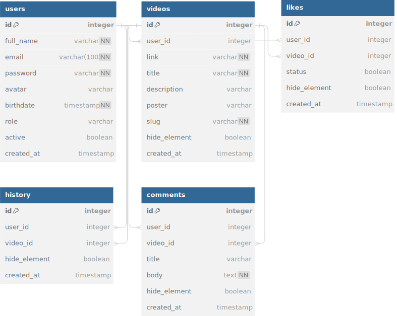

# express-postgresql-youtube-clone

## Description

This project is a YouTube clone built using Express.js and PostgreSQL. It provides a backend server for managing user authentication, video uploads, and other YouTube-like functionalities.

## Installation

To install and run this project locally, follow these steps:

1. Clone the repository

```sh
  git clone <repository_url>
```

2. Navigate to the project directory:

```sh
  cd express-postgresql-youtube-clone
```

3. Create .env file

4. Install the dependencies

```sh
  npm install
```

## Usage

To start the server, use the following command:

```sh
  npm start
```

```sh
  npm run dev
```

The server will start running on the specified port (default is 8001). You can then access the API endpoints using a tool like Postman or by making HTTP requests from your frontend application.

## API Endpoints

The following are the main API endpoints provided by this project:

- /api/login
- /api/comments
- /api/history
- /api/likes
- /api/users
- /api/videos

## Dependencies

This project has the following dependencies:

- node: ^20.9.0
- bcryptjs: ^2.4.3
- cors: ^2.8.5
- dotenv: ^16.3.1
- express: ^4.18.2
- express-validator: ^7.0.1
- jsonwebtoken: ^9.0.2
- pg: ^8.11.3
- uuid: ^9.0.1

### Dev Dependencies

This project has the following dev dependency:

- nodemon: ^3.0.2

## More imformation

The documentation folder contains more details on the database project.


